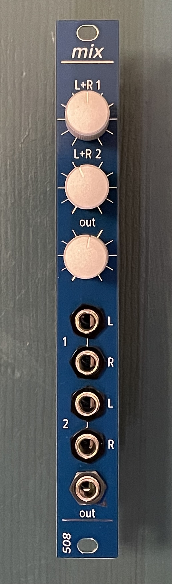

# 3hp mini mix

The 3hp mini mix is a Eurorack mixer and stereo headphone output module in 3HP. Two inputs (L/R or mono) into one stereo 3.5mm output jack suitable to drive headphones. Very clean. 

3HP, 35mm deep, 7mA +12V, 7mA -12V

This module, like many of my modules, uses 2mm-pitch male/female headers. Be sure you order/use the right thing!
